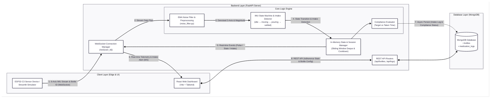

# Zero-Touch Pill Tracker (자율형 복약 및 순응도 관리 시스템)
> **노-터치 6축 자이로·가속도 센서 기반 자율형 복약 추적 및 순응도 관리 시스템**

---

## 1. Overview (개요)

* **대상 (Target)**:
* 비타민, 오메가3, 유산균 등 매일 영양제를 정해진 시간에 챙겨 먹는 현대인
* **고혈압, 당뇨, 고지혈증, 심뇌혈관 질환 등 매일 정해진 시각에 정확히 약을 복용해야 하는 만성질환자** 및 이들을 관제하는 보호자


* **핵심 가치 (Benefit)**: 스마트폰 조작이나 버튼 누름 **0회**. 약통을 들었다 내려놓는 일상적인 행동만으로 **복용 시각과 약통 종류(Device ID)가 100% 확정 및 자동 기록**되는 극상의 편의성과 데이터 정확도 제공.
* **제품 성격**: 약통별 6축 자이로·가속도(IMU) 센서 모듈 + 백엔드 실시간 센서 파이프라인 중심의 지능형 데이터 에이전트.

---
## 2. Key Features (핵심 기능)

* **버튼 0회 자율형 복약 감지 (`moving` $\rightarrow$ `settled`)**: 약통을 들었다 내려놓는 일상 동작만으로 6축 센서가 움직임 패턴을 초저지연 감지하여 복용 시각 자동 기록.
* **약통 ID 기반 100% 확정적 식별**: 소프트웨어 추측을 배제하고 약통별 고유 ID(`bottle_id`) 이벤트를 수신하여 오복용 오기록 위험 전면 차단.
* **초저지연 데이터 정제 & In-Memory 캐시 파이프라인**: NumPy 노이즈 필터링과 백엔드 In-Memory 캐시(`Deque`, `LRU Cache`)를 통해 DB 부하 없이 실시간 상태 관리.
* **복약 순응도(Medication Adherence) 대시보드**: 약통별 주간/월간 준수율, 연속 달성 일수(Streak), 시간대별 복용 패턴 데이터 시각화.
* **2단계 미복용 예방 & 보호자 비상 관제 (Phase 2)**: 정해진 시간 미복용 시 1차 거치대 부저/LED 알림 $\rightarrow$ 2차 보호자 앱 비상 Push 알림 발송.


---

## 3. Architecture (시스템 구조)

```
+-----------------------------------------------------------------------+
|                       Smart Bottles (Multi-Device)                    |
|  +---------------------------+       +-----------------------------+  |
|  | 6-Axis Gyro & Accel Sensor| ----> | ESP32-C3 Microcontroller    |  |
|  | [Bottle_01: Medication]   |       | (WebSocket Client / Wi-Fi)  |  |
|  +---------------------------+       +-----------------------------+  |
+-----------------------------------------------------------------------+
                                   |
                                   | Real-time Sensor Stream (JSON)
                                   v
+-----------------------------------------------------------------------+
|                           Backend (FastAPI)                           |
|  +-----------------------------------------------------------------+  |
|  | WebSocket Handler                                               |  |
|  +-----------------------------------------------------------------+  |
|                                  |                                    |
|                                  v                                    |
|  +-----------------------------------------------------------------+  |
|  | Data Pipeline                                                   |  |
|  |   ├── noise_filter.py (NumPy Moving Average / Low-Pass Filter)  |  |
|  |   └── imu_state.py    (moving -> settled State Machine)        |  |
|  +-----------------------------------------------------------------+  |
|                                  |                                    |
|                                  v                                    |
|  +-----------------------------------------------------------------+  |
|  | In-Memory Session Cache (session_cache.py)                      |  |
|  |   - Deque / LRU Cache for high-speed state tracking            |  |
|  |   - Persists log to DB ONLY when 'settled' event is finalized   |  |
|  +-----------------------------------------------------------------+  |
|                                  |                                    |
|                                  v                                    |
|                       +--------------------+                          |
|                       |  MongoDB Database  |                          |
|                       +--------------------+                          |
+-----------------------------------------------------------------------+
                                   |
                                   | REST API / WebSocket Events
                                   v
+-----------------------------------------------------------------------+
|                         Frontend App (React)                          |
|  +----------------------------------+  +---------------------------+  |
|  | Dashboard / Real-Time Logs       |  | Phase 2 Alert Manager     |  |
|  | (Bottle Status & Adherence Stats)|  | (Push Warning & Notif)    |  |
|  +----------------------------------+  +---------------------------+  |
+-----------------------------------------------------------------------+
```

### 3.1. Detailed Data Flow Architecture (상세 데이터 흐름도)



---

## 4. Tech Stack (기술 스택)

| 영역 | 기술 스택 | 비고 / 역할 |
| --- | --- | --- |
| **Hardware** | ESP32-C3-SuperMini, 6축 자이로·가속도 센서 (IMU) | 약통별 관성 센서 데이터 수집 및 Wi-Fi 전송 |
| **Backend** | Python 3.11+, FastAPI, WebSockets | 센서 데이터 수집, 파이프라인 처리, REST API |
| **Data Processing** | NumPy, Pandas | IMU 노이즈 필터링 및 상태 전이 데이터 정제 |
| **State & Cache** | In-Memory (Deque, LRU Cache) | 고속 세션 상태 추적 및 DB I/O 최적화 |
| **Database** | MongoDB | 센서 로그, 약통 등록 정보, 복용 이력 저장 |
| **Simulator** | Streamlit | 6축 IMU 센서 데이터 및 상태 시뮬레이션 |
| **Frontend** | React 18, TypeScript, Tailwind CSS | 반응형 웹 대시보드 |
| **DevSecOps** | Docker, Docker Compose | 멀티 컨테이너 실행 환경 구축 |

---

## 5. Project Structure (프로젝트 구조)

```
hands-free-med-tracker/
├── frontend/                              # React 반응형 웹앱
│   ├── public/
│   └── src/
│       ├── components/
│       │   ├── Dashboard.tsx              # 실시간 복약 로그 및 순응도 통계 대시보드
│       │   ├── BottleStatus.tsx           # 약통별 현재 상태(moving/settled) 표시
│       │   └── AdherenceChart.tsx         # 주간/월간 복약 순응도 그래프
│       ├── hooks/
│       │   ├── useWebSocket.ts            # WebSocket 연결 및 이벤트 수신 관리
│       │   └── useMedicationLog.ts        # 복약 로그 REST API 조회 관리
│       ├── api/
│       │   └── client.ts                  # REST API 클라이언트
│       └── App.tsx                        # 앱 진입점
│
├── backend/                               # FastAPI 백엔드 서버
│   ├── main.py                            # 앱 진입점 및 라우터 등록
│   ├── websocket/
│   │   └── handler.py                     # WebSocket 수신 및 브로드캐스트 처리
│   ├── pipeline/
│   │   ├── noise_filter.py                # NumPy 기반 IMU 센서 노이즈 필터링
│   │   └── imu_state.py                   # 가속도·자이로 기반 moving -> settled 상태 전이 감지
│   ├── state/
│   │   └── session_cache.py               # LRU Cache + Deque 기반 백엔드 세션 상태 관리
│   ├── routers/
│   │   ├── log.py                         # 복약 로그 CRUD REST API
│   │   └── bottle.py                      # 약통 등록 및 메타데이터 관리 API
│   └── db/
│       └── mongo_client.py                # MongoDB 연결 및 컬렉션 접근
│
├── simulator/                             # 6축 센서 시뮬레이터
│   ├── streamlit_app.py                   # Streamlit UI (약통 선택, 노이즈 레벨, 상태 제어)
│   ├── imu_simulator.py                   # 상태별 IMU 센서 데이터 생성기 (moving / settled)
│   └── ws_emitter.py                      # 생성된 센서 데이터를 WebSocket으로 백엔드 전송
│
├── firmware/                              # ESP32-C3 마이크로컨트롤러 임베디드 C++ 코드
│   ├── src/                               # 6축 센서 데이터 수집 및 WebSocket 전송
│   └── platformio.ini                     # PlatformIO 빌드 설정
│
└── docker-compose.yml                     # 전체 시스템 통합 실행 파일

```

---

## 6. Getting Started (실행 방법)

### 6.1. Prerequisites (사전 요구사항)

* **Docker & Docker Compose**
* **Python** v3.10 이상
* **Node.js** v18 이상

---

### 6.2. Installation & Run (설치 및 실행)

#### 전체 서비스 통합 실행 (Docker Compose)

```bash
# 1. 저장소 클론
git clone https://github.com/your-org/hands-free-med-tracker.git
cd hands-free-med-tracker

# 2. 전체 컨테이너 동시 구동 (MongoDB, Backend, Simulator, Frontend)
docker-compose up --build -d

```

#### 개별 서비스 매뉴얼 실행 (Manual Run)

```bash
# 1. MongoDB 실행
docker-compose up -d mongodb

# 2. 백엔드 서버 실행 (FastAPI)
cd backend
python -m venv venv
source venv/bin/activate  # Windows: venv\Scripts\activate
pip install -r requirements.txt
uvicorn main:app --reload --port 8000

# 3. 센서 시뮬레이터 실행 (Streamlit)
cd ../simulator
pip install -r requirements.txt
streamlit run streamlit_app.py --server.port 8501

# 4. 프론트엔드 앱 실행 (React)
cd ../frontend
npm install
npm run dev

```

---

### 6.3. 서비스 접속 포트

| 서비스 | URL | 비고 |
| --- | --- | --- |
| **Frontend** | [http://localhost:5173](http://localhost:5173) | React 반응형 웹앱 |
| **Backend API** | [http://localhost:8000](http://localhost:8000) | FastAPI 서버 |
| **API Docs** | [http://localhost:8000/docs](http://localhost:8000/docs) | Swagger API 문서 |
| **Simulator** | [http://localhost:8501](http://localhost:8501) | Streamlit IMU 센서 시뮬레이터 |
| **MongoDB** | `localhost:27017` | MongoDB 데이터베이스 |