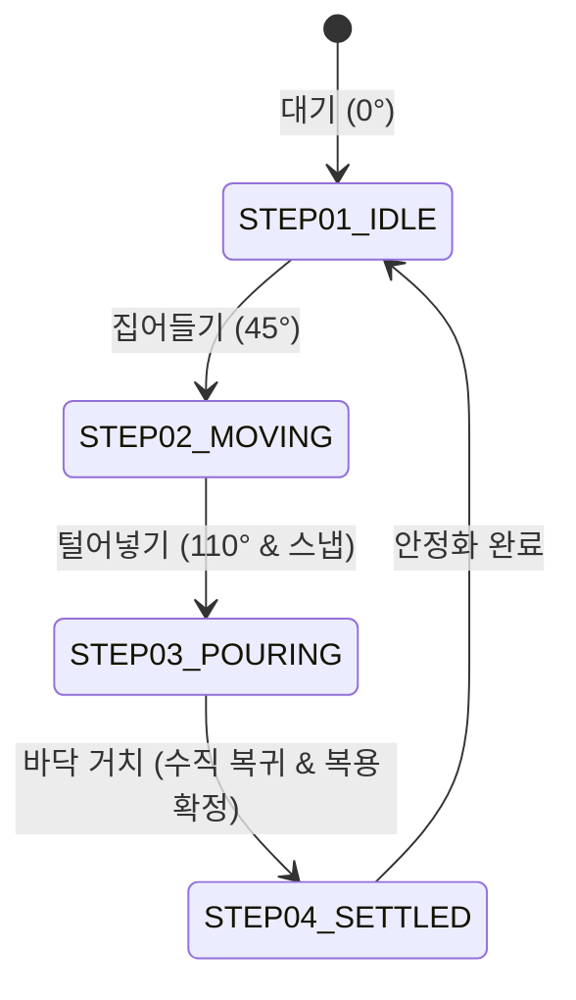

# [Troubleshooting] 복용 감지 후 FSM 상태 고착(MOVING) 버그 분석 및 해결 보고서

## 1. 개요 (Overview)

| 항목 | 내용 |
| :--- | :--- |
| **문제 현상** | 시뮬레이터 또는 실기기에서 약을 복용하고 제자리에 놓았을 때, 오늘 복용 완료(녹색 뱃지) 및 이력은 기록되었으나 실시간 FSM 데모 뷰가 마지막 단계(`STEP 04: SETTLED`)로 전이되지 않고 `STEP 02: MOVING`에 멈춰 있는 현상 |
| **영향 범위** | `backend/pipeline/imu_state.py`, `backend/websocket/handler.py`, `frontend/src/App.tsx` |
| **해결 일자** | 2026-10-02 |

---

## 2. 현상 및 원인 분석 (Root Cause Analysis)

### 2.1 슬라이딩 윈도우 크기 고정 (`WINDOW_SIZE = 100`)에 의한 지연
- **기존 로직**:
  백엔드 [imu_state.py](file:///Users/somui/workplace/zero-touch-pill-tracker/backend/pipeline/imu_state.py)의 `detect_bottle_state` 함수는 50Hz 기준 2.0초 분량에 해당하는 100개의 샘플이 슬라이딩 윈도우(`sensor_window`)에 가득 차기 전까지는 무조건 `'moving'` 상태를 반환하도록 하드코딩되어 있었습니다.

  ```python
  # 기존 코드 (문제 지점)
  def detect_bottle_state(sensor_window: deque[SensorReading]) -> BottleState:
      if len(sensor_window) < WINDOW_SIZE:  # WINDOW_SIZE = 100
          return 'moving'  # 100개가 채워질 때까지 무조건 moving 반환
      ...
  ```

### 2.2 복용 판정 시점의 윈도우 초기화 (`clear()`) 부작용
- 백엔드 WebSocket 핸들러([handler.py](file:///Users/somui/workplace/zero-touch-pill-tracker/backend/websocket/handler.py#L203))는 복용이 완료되면 중복 감지 방지를 위해 슬라이딩 윈도우를 초기화(`session.recent_sensor_window.clear()`)합니다.
- 이로 인해 약통을 바닥에 내려놓은 뒤에도 윈도우 샘플 수가 0부터 다시 시작되어, **100개가 쌓일 때까지 최소 2초 이상 `moving` 상태로 고착**되었습니다.

### 2.3 프론트엔드 상태 동기화 우선순위 누락
- 프론트엔드는 `medication_taken` 이벤트(복용 확정)와 `bottle_state_changed` 이벤트를 분리하여 처리하고 있었습니다.
- 복용 완료 패킷을 수신하더라도 직후 도착하는 센서 상태가 `moving`으로 전달되면서 UI의 FSM 상태가 2단계로 되돌아가는 플리커링이 발생했습니다.

---

## 3. 해결 방안 및 구현 (Implementation)

### 3.1 동적 평가 윈도우 도입 및 거치 판정 최적화 (`imu_state.py`)
- 100개의 버퍼를 전부 기다리지 않고, **최근 15~25개(0.3~0.5초) 샘플**만으로도 즉시 분산과 기울기를 평가하도록 개선했습니다.
- 약통이 수직(Z축 가속도 $\ge 8.5\text{ m/s}^2$, 0도)으로 돌아오고 진동이 잦아들면 즉시 `settled` 상태로 전환됩니다.

```python
# 수정된 코드 (backend/pipeline/imu_state.py)
MIN_EVAL_WINDOW = 15

def detect_bottle_state(sensor_window: deque[SensorReading]) -> BottleState:
    if len(sensor_window) < MIN_EVAL_WINDOW:
        return 'settled' if len(sensor_window) == 0 else 'moving'

    readings = list(sensor_window)

    # 1. 110도 털어넣기 스냅 모션 검사
    latest = readings[-1]
    if latest.acc_z < POURING_ACC_Z_MAX and math.sqrt(latest.acc_x**2 + latest.acc_y**2) > POURING_ACC_XY_MIN:
        return 'pouring'

    # 2. 최근 0.4초(25개) 샘플의 진동/분산 평가
    recent_eval = readings[-min(len(readings), 25):]
    accel_dev_mean = sum(abs(r.accel_magnitude - 1.0) for r in recent_eval) / len(recent_eval)
    gyro_values = [r.gyro_magnitude for r in recent_eval]
    gyro_mean = sum(gyro_values) / len(gyro_values)
    gyro_var = sum((v - gyro_mean) ** 2 for v in gyro_values) / len(gyro_values)

    # 수직 거치(Z축 8.5 m/s² 이상) 상태에서 진동 안정 시 즉시 settled 전이
    is_upright = latest.acc_z >= 8.5 and abs(latest.acc_x) < 3.0 and abs(latest.acc_y) < 3.0
    if is_upright and accel_dev_mean <= MOVE_ACCEL_THRESHOLD and gyro_var <= MOVE_GYRO_VAR:
        return 'settled'

    if accel_dev_mean > MOVE_ACCEL_THRESHOLD or gyro_var > MOVE_GYRO_VAR:
        return 'moving'
    return 'settled'
```

### 3.2 프론트엔드 실시간 동기화 보강 (`App.tsx`)
- `medication_taken` 이벤트 수신 시 UI 상의 약통 상태를 즉시 `settled`로 확정 반영합니다.
- 실시간 센서값(`sensor_reading`)이 0도 및 수직 거치 상태일 때 `moving`에 갇혀 있지 않고 자연스럽게 `idle`로 복귀하도록 방어 로직을 추가했습니다.

```typescript
// 수정된 코드 (frontend/src/App.tsx)
if (lastEvent.type === 'sensor_reading' && lastEvent.payload) {
  setLastSensorReading(lastEvent.payload);
  const bId = lastEvent.payload.bottle_id;
  if (bId) {
    setLastPulseTimes((prev) => ({ ...prev, [bId]: Date.now() }));
    // 수직 거치(0도/9.8m/s²) 감지 시 idle로 자동 복귀
    if (lastEvent.payload.state_deg === 0 && lastEvent.payload.acc_z >= 8.5) {
      setBottleStates((prev) => (prev[bId] === 'moving' ? { ...prev, [bId]: 'idle' } : prev));
    }
  }
}

if (lastEvent.type === 'medication_taken' && lastEvent.payload?.bottle_id) {
  const bId = lastEvent.payload.bottle_id;
  setLastPulseTimes((prev) => ({ ...prev, [bId]: Date.now() }));
  setBottleStates((prev) => ({ ...prev, [bId]: 'settled' })); // 복용 완료 즉시 4단계 확정
  loadData();
}
```

---

## 4. 검증 결과 (Verification)



1. **원클릭 5초 자동 복용 시나리오 테스트**:
   - `STEP 01: IDLE` ➔ `STEP 02: MOVING` ➔ `STEP 03: POURING` ➔ **`STEP 04: SETTLED`** 단계가 지연 없이 순차적으로 끝까지 활성화됨 확인.
2. **복용 완료 뱃지 및 타임라인 동기화**:
   - 복용 완료 처리와 동시에 그래프 및 FSM 뱃지가 정상적으로 `SETTLED` 상태를 표출한 뒤 안정 상태(`IDLE`)로 연계됨 확인.
